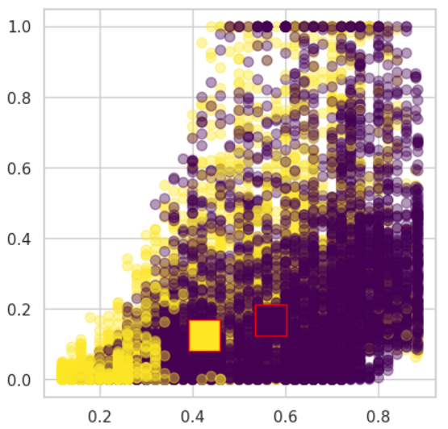
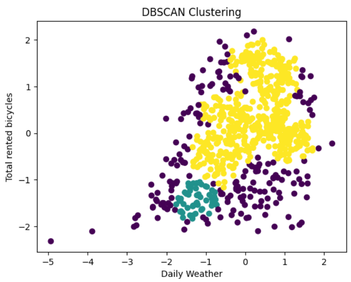

# Project Description

The project's objective is to perform clustering on a selected dataset.

The group task involves data preprocessing and analysis, hypothesis formulation, and implementing prototype-based clustering. To determine the clustering tendency, Hopkins statistic was calculated, and for identifying the number of clusters, both the Elbow method and Silhouette method were employed.

For the individual task, the DBSCAN algorithm was chosen. This algorithm belongs to density-based methods. The purpose of density-based clustering is to locate regions of high density separated by regions of low density. The motivation for selecting this algorithm lies in its capability to determine the number of clusters automatically based on the data density, eliminating the need for a prior assumption about the number of clusters.

## Dataset

The dataset used for the project can be found at:

https://archive.ics.uci.edu/dataset/275/bike+sharing+dataset

## Results

    <h4>K-Means Clustering Visualization</h4>
    

    <h4>Visualizing DBSCAN Results</h4>
    

